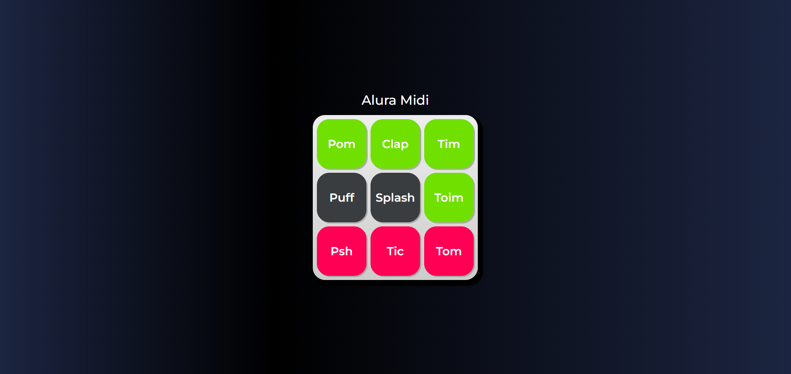

<h1> Alura Midi</h1>

Este é um curso da Alura sobre JavaScript para Web, focado em entender os papéis das tecnologias web, conectar JavaScript com HTML usando o DOM, criar funções, resolver problemas de código, selecionar operadores lógicos e produzir soluções simples para páginas dinâmicas.

</img>
